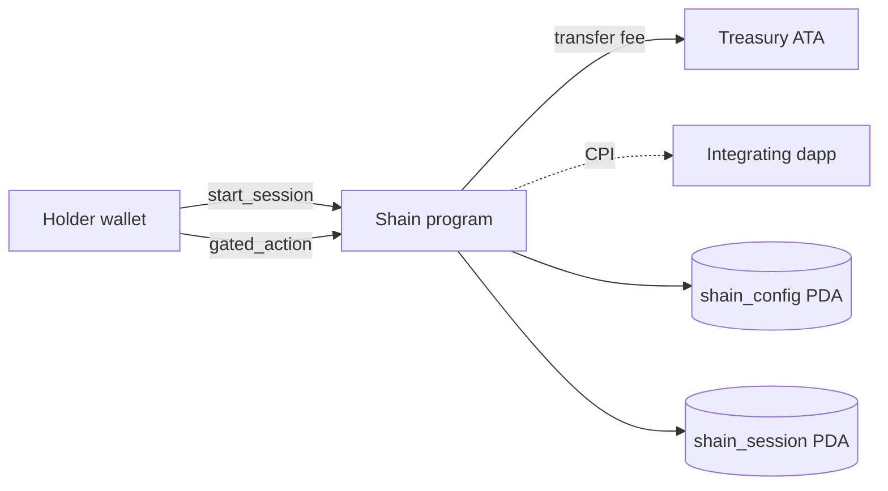

<p align="center">
  <a href="https://shain.fun">
    
  </a>
</p>

<p align="center">
  <a href="LICENSE">
    
  </a>
  <a href="https://github.com/shain-labs/shain-engine/actions/workflows/ci.yml">
    
  </a>
  <a href="https://github.com/shain-labs/shain-engine/releases">
    
  </a>
  <a href="https://github.com/shain-labs/shain-engine/commits/main">
    
  </a>
  <a href="https://github.com/shain-labs/shain-engine/graphs/contributors">
    
  </a>
  <a href="https://github.com/shain-labs/shain-engine">
    
  </a>
  <a href="https://github.com/shain-labs/shain-engine/issues">
    
  </a>
  <a href="https://github.com/shain-labs/shain-engine/stargazers">
    
  </a>
  <a href="https://x.com/shainfun">
    
  </a>
  <a href="https://shain.fun">
    
  </a>
  <a href="https://shain.fun/docs">
    
  </a>
</p>

Shain is a holder-gated private session engine for Solana, written in Rust
on Anchor 1.0. Hold `$SHAIN`, open a 24-hour private session on your wallet,
and route any downstream on-chain action past mempool watchers — snipers,
mirror bots and indexers lose the correlation for the life of the session.

## Features

| Capability                          | Status | Scope                                                      |
| ----------------------------------- | ------ | ---------------------------------------------------------- |
| Holder-gated session (24h default)  | stable | Anchor program, no custody, no lock-up                     |
| Per-wallet PDA session state        | stable | `shain_session` seed, owner-only state                     |
| Fee-accrual treasury ATA            | stable | `shain_treasury` PDA-owned ATA for session fees            |
| Gating hook (`gated_action`)        | stable | CPI target for downstream dapps, session-lifetime gate     |
| Session cleanup with rent refund    | stable | Anyone can `close_session()` post-expiry                   |
| TypeScript client SDK               | beta   | Anchor-idiomatic SDK with PDA helpers and instruction bldr |
| Rust CLI (`shain`)                  | beta   | Local session management + manifest verifier               |
| Devnet integration test scaffolding | alpha  | End-to-end smoke test against `api.devnet.solana.com`      |

## Architecture



The program is four instructions on top of a single config PDA and a
per-wallet session PDA. There is no admin mutation path, no pausable
state, and no relayer.

- **`initialize(params)`** — authority seeds the config PDA and creates the
  treasury ATA. Called once.
- **`start_session()`** — holder verifies `balance >= min_holding`, pays
  the session fee, and opens a 24-hour window.
- **`gated_action(tag)`** — fires only while the caller's session is
  active. Integrating dapps CPI here before their private call.
- **`close_session()`** — cleans up after expiry, refunds rent to the
  session owner.

See [docs.shain.fun/engine/architecture](https://shain.fun/docs/engine/architecture)
for the full state diagram and CPI flow.

## Performance

| Instruction       | Compute units | Ix size | Caller        |
| ----------------- | ------------- | ------- | ------------- |
| `initialize`      | 4,128         | 137 B   | authority     |
| `start_session`   | 3,812         | 88 B    | holder        |
| `gated_action`    | 1,914         | 22 B    | holder · CPI  |
| `close_session`   | 2,206         | 16 B    | anyone        |

| Account             | Layout       | Seeds                                          |
| ------------------- | ------------ | ---------------------------------------------- |
| `ShainConfig`       | 8 + 154 B    | `["shain_config"]`                             |
| `ShainSession`      | 8 + 65 B     | `["shain_session", user]`                      |
| Treasury authority  | pass-through | `["shain_treasury"]`                           |

## Build

```bash
git clone https://github.com/shain-labs/shain-engine
cd shain-engine
rustup toolchain install 1.89.0
solana-install init 3.1.13
avm install 1.0.0 && avm use 1.0.0
anchor build
cargo test --package shain --test test_shain
```

## Quick start

### TypeScript client

```ts
import { ShainClient } from "@shain/sdk";
import { Connection, Keypair, PublicKey } from "@solana/web3.js";

const connection = new Connection("https://api.devnet.solana.com", "confirmed");
const wallet = Keypair.generate();

const client = new ShainClient({
  connection,
  programId: new PublicKey("2T1Qs7f2hiy1sUQBWC7226xhXvCees97UfeqReRrnE66"),
  wallet,
});

const session = await client.startSession({
  shainMint: SHAIN_MINT,
  userTokenAccount: userAta,
});
// { signature, sessionPda, startedAt, expiresAt }

const hook = await client.gatedAction({ tag: 1n });
// { signature, tag, actionsCount: 1 }
```

### Rust program (CPI)

```rust
use anchor_lang::prelude::*;
use shain::cpi::accounts::GatedAction;
use shain::cpi::gated_action;

pub fn private_swap<'info>(ctx: Context<'_, '_, '_, 'info, PrivateSwap<'info>>) -> Result<()> {
    let cpi_ctx = CpiContext::new(
        ctx.accounts.shain_program.to_account_info(),
        GatedAction {
            user: ctx.accounts.user.to_account_info(),
            shain_session: ctx.accounts.shain_session.to_account_info(),
        },
    );
    gated_action(cpi_ctx, /* tag */ 42)?;
    // proceed with the actual private route
    Ok(())
}
```

### CLI

```bash
shain init --network devnet \
  --mint <MINT_ADDRESS> --fee 1000000 --min-hold 10000000 --duration 86400

shain session open --wallet ~/.config/solana/id.json

shain session status
# Session open · 23h 41m remaining · 2 gated actions so far
```

## Project structure

```
shain-engine/
├── programs/
│   └── shain/
│       ├── src/
│       │   ├── lib.rs                 # #[program] dispatch
│       │   ├── constants.rs           # PDA seeds, defaults
│       │   ├── error.rs               # ShainError enum
│       │   ├── state.rs               # ShainConfig, ShainSession
│       │   ├── instructions.rs        # module re-exports
│       │   └── instructions/
│       │       ├── initialize.rs      # config + treasury ATA bootstrap
│       │       ├── start_session.rs   # open 24h private session
│       │       ├── gated_action.rs    # session-active gate for CPI
│       │       └── close_session.rs   # rent-refund cleanup
│       ├── tests/
│       │   └── test_shain.rs          # 9 litesvm integration tests
│       ├── Cargo.toml
│       ├── Xargo.toml                 # BPF target
│       └── README.md
├── sdk/                               # TypeScript client
│   ├── src/
│   │   ├── index.ts                   # public surface
│   │   ├── client.ts                  # ShainClient
│   │   ├── session.ts                 # snapshot + helpers
│   │   ├── pda.ts                     # PDA derivation
│   │   ├── types.ts                   # Anchor-aligned types
│   │   ├── errors.ts                  # ShainSdkError
│   │   └── constants.ts
│   ├── tests/session.test.ts
│   └── package.json
├── cli/                               # Rust CLI
│   ├── src/
│   │   ├── main.rs
│   │   └── commands/{init,session,config_show,pdas,verify}.rs
│   └── Cargo.toml
├── examples/                          # runnable integration samples
│   ├── basic_session.ts
│   ├── gate_swap.ts
│   └── monitor_session.rs
├── tests/integration/                 # devnet e2e
│   └── devnet.test.ts
├── docs/                              # architecture + notes (30 files)
├── idl/shain.json                     # exported IDL
├── .github/                           # workflows, templates, dependabot
├── Anchor.toml
├── Cargo.toml
├── Dockerfile
├── Makefile
└── README.md
```

## Deployments

| Cluster        | Status        | Program ID                                       |
| -------------- | ------------- | ------------------------------------------------ |
| Localnet       | reserved      | `2T1Qs7f2hiy1sUQBWC7226xhXvCees97UfeqReRrnE66`   |
| Devnet         | pending       | `2T1Qs7f2hiy1sUQBWC7226xhXvCees97UfeqReRrnE66`   |
| Mainnet-beta   | pending audit | _no address until deployed_                       |

Cross-verify the program id against four surfaces — they must all
agree:

- This README (`Deployments` section above)
- [`/api/health`](https://shain.fun/api/health)
- [`/.well-known/shain.json`](https://shain.fun/.well-known/shain.json)
- The CLI: `shain verify --json`

If the four surfaces disagree, **trust none of them** until the
inconsistency is resolved.

## Contributing

See [CONTRIBUTING.md](./CONTRIBUTING.md) for the development setup,
commit conventions, and pull-request checklist. Security reports: see
[SECURITY.md](./SECURITY.md). Read the full
[Code of Conduct](./CODE_OF_CONDUCT.md) before participating.

## License

Released under the [MIT License](./LICENSE).

## Links

- Website: https://shain.fun
- Docs: https://shain.fun/docs
- X: @shainfun
- GitHub: shain-labs/shain-engine
- Ticker: $SHAIN
- Program ID (devnet, reserved): `2T1Qs7f2hiy1sUQBWC7226xhXvCees97UfeqReRrnE66`
