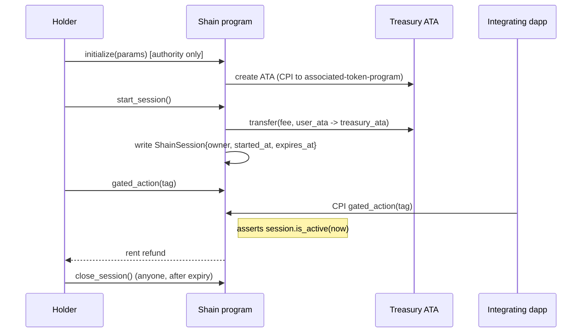

# Architecture

Shain is a four-instruction Anchor program with two account types.
This document describes the on-chain state, the instruction lifecycle,
and the integration surface a downstream dapp uses to gate a call.

## Account layout

### `ShainConfig` (singleton)

Derived from seeds `[b"shain_config"]`. Written once by the program
authority during `initialize`. Fields:

| Field                 | Type     | Notes                                              |
| --------------------- | -------- | -------------------------------------------------- |
| `authority`           | `Pubkey` | The signer that seeded the config                  |
| `shain_mint`        | `Pubkey` | The SHAIN SPL mint                               |
| `treasury_ata`        | `Pubkey` | Associated token account owned by the treasury PDA |
| `session_duration`    | `i64`    | Seconds; defaults to 86400 (24 hours)              |
| `session_fee`         | `u64`    | Token base units charged on each `start_session`   |
| `min_holding`         | `u64`    | Token base units required in the signer's ATA      |
| `total_sessions`      | `u64`    | Lifetime sessions opened across all holders        |
| `total_fees_collected`| `u64`    | Running total of session fees accrued              |
| `bump`, `treasury_bump` | `u8`, `u8` | Cached PDA bumps                                |

### `ShainSession` (one per holder)

Derived from seeds `[b"shain_session", user.as_ref()]`. Created on
`start_session` and closed by `close_session`.

| Field             | Type     | Notes                                              |
| ----------------- | -------- | -------------------------------------------------- |
| `owner`           | `Pubkey` | The holder — must match the signer                 |
| `started_at`      | `i64`    | Unix seconds when the session opened               |
| `expires_at`      | `i64`    | `started_at + session_duration`                    |
| `actions_count`   | `u64`    | Count of `gated_action` calls during this session  |
| `total_sessions`  | `u64`    | Count of lifetime sessions for this holder         |
| `bump`            | `u8`     | Cached PDA bump                                    |

## Instruction lifecycle

## Security properties

- **No custody.** The treasury PDA never holds user SOL. It holds SHAIN
  session fees only. Users always sign their own transactions.
- **No upgrade authority.** When deployed to mainnet, the program's
  upgrade authority is discarded. The Anchor IDL export is stored in
  the repository at `idl/shain.json` for long-term auditability.
- **No admin mutation.** After `initialize`, no instruction mutates
  `ShainConfig` state that is not derived from a holder's action
  (session fee accrual, lifetime session count, etc).
- **No pausable.** There is no kill switch. The only operational knob is
  the authority's initial `session_duration`.

## Failure modes

See `programs/shain/src/error.rs` for the full enum. Most likely
encountered:

- `HolderBalanceTooLow` (`6001`): caller does not hold `min_holding`.
- `SessionAlreadyActive` (`6002`): caller has an active session.
- `SessionExpired` (`6003`): called `gated_action` after expiry.
- `TokenAccountOwnerMismatch` / `TokenAccountMintMismatch`: client sent
  the wrong ATA.
